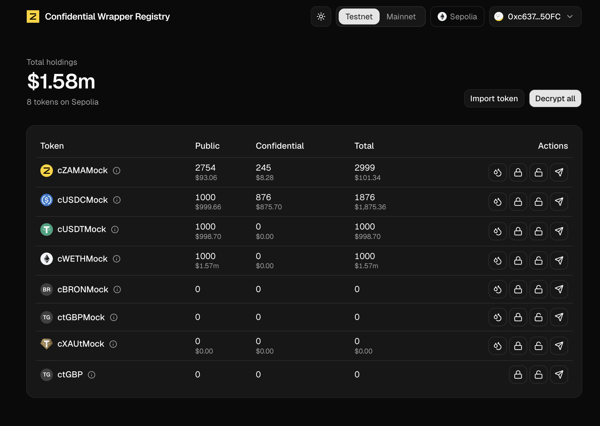
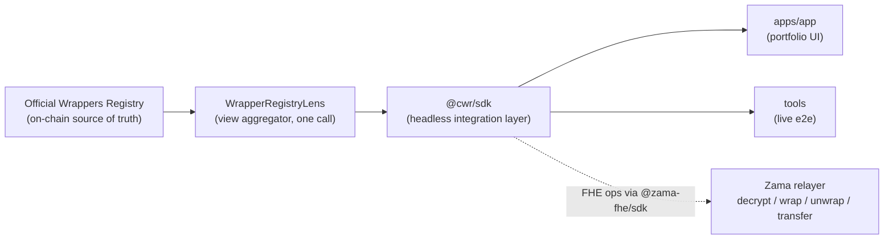

# Confidential Wrapper Registry

[](https://github.com/codeytechie/erc7984-wrapper-registry/actions/workflows/ci.yml)
[](./LICENSE)

Surfaces **every** ERC-20 ↔ ERC-7984 pair in Zama's official Confidential Token
Wrappers Registry and lets anyone **wrap, unwrap, decrypt (EIP-712), and faucet**,
turning the on-chain registry into a usable product.

> 🔗 **Live app:** `TODO: deployed URL` • 🎥 **Demo (2-3 min):** `TODO: video link`



---

## What it does: the 4 required features

- **Surfaces every pair, live from the registry.** Reads all pairs on-chain through the
  deployed [`WrapperRegistryLens`](#6-deployed-addresses) in one call with full metadata:
  all **8** Sepolia pairs including the non-mock `ctGBP`, revoked pairs surfaced (never
  silently dropped), plus an **import** flow for off-list / mainnet pairs.
- **Wrap / unwrap** any pair: deposit a public ERC-20 to mint its confidential wrapper,
  and the full **two-step asynchronous unwrap** (request → public-decrypt → finalize),
  with resume for an interrupted unwrap.
- **Decrypt** any ERC-7984 balance via the **EIP-712 user-decryption** flow: one-signature
  batch **Decrypt all**, cached for the session.
- **Sepolia faucet** for the official cToken mocks, straight from each row.

---

## How it meets the judging criteria

| Criterion | How this submission addresses it |
|---|---|
| **Coverage** | Live registry read via the on-chain Lens; all **8** Sepolia pairs incl. the non-mock `ctGBP`; 6- and 18-decimal tokens; **revoked pairs surfaced** (`isValid=false`, never dropped); **import** for off-list pairs; **testnet + mainnet** modes (Lens deployed and verified on both). |
| **Correctness** | **29 contract tests, 100% statements / functions / lines** (95% branches); **live end-to-end against the official contracts** (`tools/`, output below); correct two-step unwrap + finalize, `(bool,address)` tuple decoding, and rate rounding/refund. |
| **Extensibility** | Fully **registry-driven**, so new official pairs appear with **zero code change**; reusable headless [`@cwr/sdk`](#7-monorepo-layout); the `WrapperRegistryLens` on-chain artifact; the import flow; a "bring your own pair" path via the mock registry harness; config-driven chains. |
| **UX** | RainbowKit connect; one-signature **Decrypt all**; balances **masked until revealed**; per-action dialogs showing the token; **USD totals**; token icons; wrong-network detection + switch; typed, human error messages; light/dark. |
| **Code quality** | Strict TypeScript (no `any` at boundaries); a **typed error taxonomy** mapping `@zama-fhe/sdk` + viem errors to user messages; CI on every push; coverage; clean monorepo separation (contracts / sdk / services / apps). |
| **Production-readiness** | Public deploy (`TODO: URL`); CI gate; graceful **RPC / relayer / price fallbacks**; env validation; **Etherscan-verified** Lens on Sepolia **and** mainnet; server-side proxy so the mainnet relayer key never ships to the browser. |

---

## Architecture

The **official registry is the single source of truth**; everything above it is a thin,
reusable product layer.



- **`WrapperRegistryLens`** aggregates the registry's paginated getters plus per-token
  metadata (symbol, decimals, rate, validity, inferred supply) into a single call, with
  `try/catch` resilience for tokens that revert on metadata.
- **`@cwr/sdk`** isolates four FHE touchpoints behind `@zama-fhe/sdk`: balance decrypt
  (EIP-712), wrap (shield), two-step unwrap (unshield + finalize), and confidential
  transfer. Everything else (registry reads, public balances, faucet, approvals) is plain
  **viem**.
- The apps are a UI over the SDK; nothing hard-codes the pair list.

---

## 6. Deployed addresses

We deploy **only** the Lens; the registry and cTokens are Zama's official contracts.

| Contract | Network | Address |
|---|---|---|
| Registry proxy (official) | Sepolia | [`0x2f0750Bbb0A246059d80e94c454586a7F27a128e`](https://sepolia.etherscan.io/address/0x2f0750Bbb0A246059d80e94c454586a7F27a128e) |
| `WrapperRegistryLens` (verified) | Sepolia | [`0x1B0Cd34931B6f600DeA694ffDb690f3b6d53e940`](https://sepolia.etherscan.io/address/0x1B0Cd34931B6f600DeA694ffDb690f3b6d53e940#code) |
| Registry proxy (official) | Mainnet | [`0xeb5015fF021DB115aCe010f23F55C2591059bBA0`](https://etherscan.io/address/0xeb5015fF021DB115aCe010f23F55C2591059bBA0) |
| `WrapperRegistryLens` (verified) | Mainnet | [`0xaaE82e1872eaF6101B044Bc5dddd7566e688c06d`](https://etherscan.io/address/0xaaE82e1872eaF6101B044Bc5dddd7566e688c06d#code) |

**Lens deployment transactions**

- Sepolia: [`0x3c9c537a0f5103448c4c8fc90c2fe1300e7aacaaaa9c98bf56005b7c1f938e2d`](https://sepolia.etherscan.io/tx/0x3c9c537a0f5103448c4c8fc90c2fe1300e7aacaaaa9c98bf56005b7c1f938e2d)
- Mainnet: [`0x7aae6764ea639ac408858d8e9ed96ea3efcd7847bedb208cb8ad9b7154d109b6`](https://etherscan.io/tx/0x7aae6764ea639ac408858d8e9ed96ea3efcd7847bedb208cb8ad9b7154d109b6)

Mainnet mode surfaces pairs and supports wrap/unwrap; mainnet **decrypt** additionally
needs a Zama mainnet relayer API key (kept server-side, see [Security](#12-security--limitations)).

<details>
<summary><b>All registered pairs (Sepolia: 8, Mainnet: 9)</b>: underlying + wrapper addresses</summary>

**Sepolia** (official faucetable mocks; `ctGBP` is non-mock)

| Symbol | Underlying (ERC-20) | Wrapper (ERC-7984) |
|---|---|---|
| cUSDCMock | [0x9b5Cd13b8eFbB58Dc25A05CF411D8056058aDFfF](https://sepolia.etherscan.io/address/0x9b5Cd13b8eFbB58Dc25A05CF411D8056058aDFfF) | [0x7c5BF43B851c1dff1a4feE8dB225b87f2C223639](https://sepolia.etherscan.io/address/0x7c5BF43B851c1dff1a4feE8dB225b87f2C223639) |
| cUSDTMock | [0xa7dA08FafDC9097Cc0E7D4f113A61e31d7e8e9b0](https://sepolia.etherscan.io/address/0xa7dA08FafDC9097Cc0E7D4f113A61e31d7e8e9b0) | [0x4E7B06D78965594eB5EF5414c357ca21E1554491](https://sepolia.etherscan.io/address/0x4E7B06D78965594eB5EF5414c357ca21E1554491) |
| cWETHMock | [0xff54739b16576FA5402F211D0b938469Ab9A5f3F](https://sepolia.etherscan.io/address/0xff54739b16576FA5402F211D0b938469Ab9A5f3F) | [0x46208622DA27d91db4f0393733C8BA082ed83158](https://sepolia.etherscan.io/address/0x46208622DA27d91db4f0393733C8BA082ed83158) |
| cBRONMock | [0xFf021fB13cA64e5354c62c954b949a88cfDEb25E](https://sepolia.etherscan.io/address/0xFf021fB13cA64e5354c62c954b949a88cfDEb25E) | [0xaa5612FA27c927a0c7961f5AEFEE5ba3A0F9C891](https://sepolia.etherscan.io/address/0xaa5612FA27c927a0c7961f5AEFEE5ba3A0F9C891) |
| cZAMAMock | [0x75355a85c6FB9df5f0C80FF54e8747EEe9a0BF57](https://sepolia.etherscan.io/address/0x75355a85c6FB9df5f0C80FF54e8747EEe9a0BF57) | [0xf2D628d2598aF4eAF94CB76a437Ff86CA78FfbFB](https://sepolia.etherscan.io/address/0xf2D628d2598aF4eAF94CB76a437Ff86CA78FfbFB) |
| ctGBPMock | [0x93c931278A2aad1916783F952f94276eA5111442](https://sepolia.etherscan.io/address/0x93c931278A2aad1916783F952f94276eA5111442) | [0xfCE5c7069c5525eF6c8C2b2E35A745bA20a2F7CC](https://sepolia.etherscan.io/address/0xfCE5c7069c5525eF6c8C2b2E35A745bA20a2F7CC) |
| cXAUtMock | [0x24377AE4AA0C45ecEe71225007f17c5D423dd940](https://sepolia.etherscan.io/address/0x24377AE4AA0C45ecEe71225007f17c5D423dd940) | [0xe4FcF848739845BC81Dee1d5352cf3844F0a60C7](https://sepolia.etherscan.io/address/0xe4FcF848739845BC81Dee1d5352cf3844F0a60C7) |
| ctGBP | [0xf6Ef9ADB61A48E29E36bc873070A46A3D2667ff3](https://sepolia.etherscan.io/address/0xf6Ef9ADB61A48E29E36bc873070A46A3D2667ff3) | [0x167DC962808B32CFFFc7e14B5018c0bE06A3A208](https://sepolia.etherscan.io/address/0x167DC962808B32CFFFc7e14B5018c0bE06A3A208) |

**Mainnet** (real assets: USDC, USDT, WETH, etc.)

| Symbol | Underlying (ERC-20) | Wrapper (ERC-7984) |
|---|---|---|
| cUSDC | [0xA0b86991c6218b36c1d19D4a2e9Eb0cE3606eB48](https://etherscan.io/address/0xA0b86991c6218b36c1d19D4a2e9Eb0cE3606eB48) | [0xe978F22157048E5DB8E5d07971376e86671672B2](https://etherscan.io/address/0xe978F22157048E5DB8E5d07971376e86671672B2) |
| cUSDT | [0xdAC17F958D2ee523a2206206994597C13D831ec7](https://etherscan.io/address/0xdAC17F958D2ee523a2206206994597C13D831ec7) | [0xAe0207C757Aa2B4019Ad96edD0092ddc63EF0c50](https://etherscan.io/address/0xAe0207C757Aa2B4019Ad96edD0092ddc63EF0c50) |
| cWETH | [0xC02aaA39b223FE8D0A0e5C4F27eAD9083C756Cc2](https://etherscan.io/address/0xC02aaA39b223FE8D0A0e5C4F27eAD9083C756Cc2) | [0xda9396b82634Ea99243cE51258B6A5Ae512D4893](https://etherscan.io/address/0xda9396b82634Ea99243cE51258B6A5Ae512D4893) |
| cBRON | [0xBA2C598E11eD093079cC324FCa5BbbA99F616E83](https://etherscan.io/address/0xBA2C598E11eD093079cC324FCa5BbbA99F616E83) | [0x85dE671c3bec1aDeD752c3Cea943521181C826bc](https://etherscan.io/address/0x85dE671c3bec1aDeD752c3Cea943521181C826bc) |
| cZAMA | [0xA12CC123ba206d4031D1c7f6223D1C2Ec249f4f3](https://etherscan.io/address/0xA12CC123ba206d4031D1c7f6223D1C2Ec249f4f3) | [0x80CB147Fd86dC6dEe3Eee7e4Cee33d1397d98071](https://etherscan.io/address/0x80CB147Fd86dC6dEe3Eee7e4Cee33d1397d98071) |
| ctGBP | [0x27f6c8289550fCE67f6B50BeD1F519966aFE5287](https://etherscan.io/address/0x27f6c8289550fCE67f6B50BeD1F519966aFE5287) | [0xa873750ccBafD5ec7Dd13bfD5237d7129832eDD9](https://etherscan.io/address/0xa873750ccBafD5ec7Dd13bfD5237d7129832eDD9) |
| cXAUt | [0x68749665FF8D2d112Fa859AA293F07A622782F38](https://etherscan.io/address/0x68749665FF8D2d112Fa859AA293F07A622782F38) | [0x73cc9aF9d6BEFdb3c3fAf8a5E8c05Cb95FdaEEf1](https://etherscan.io/address/0x73cc9aF9d6BEFdb3c3fAf8a5E8c05Cb95FdaEEf1) |
| cbbqTGBP | [0xbeeffABcd0dB09589Dd21854aa760C52aB4bf04F](https://etherscan.io/address/0xbeeffABcd0dB09589Dd21854aa760C52aB4bf04F) | [0xBA4cFF6ED6F7Cb2A58776dECa4E984b498446762](https://etherscan.io/address/0xBA4cFF6ED6F7Cb2A58776dECa4E984b498446762) |
| csteakcUSDC | [0xbEEF00A59B577423653A1526c7009bdE103F542B](https://etherscan.io/address/0xbEEF00A59B577423653A1526c7009bdE103F542B) | [0x66Bf74E96900D1a19c7070D939D124f2F565C458](https://etherscan.io/address/0x66Bf74E96900D1a19c7070D939D124f2F565C458) |

Pair lists are read live from the registry, so this table is a snapshot; the app always
reflects current on-chain state.

</details>

---

## 7. Monorepo layout

| Package | What |
|---|---|
| `contracts/` | `WrapperRegistryLens` (deployed) + full FHEVM mock harness. Standalone Hardhat project. |
| `sdk/` (`@cwr/sdk`) | Headless integration layer: viem reads + `@zama-fhe/sdk` for the FHE touchpoints. |
| `tools/` (`@cwr/tools`) | Live Sepolia end-to-end verification against the official contracts. |
| `services/price-oracle/` (`@cwr/price-oracle`) | Standalone cached USD price service (zero runtime deps). |
| `services/proxy/` (`@cwr/proxy`) | Server-side proxy for private RPC and the Zama relayer key (origin-allowlisted). |
| `apps/landing/` (`@cwr/landing`) | Branded landing page. |
| `apps/app/` (`@cwr/app`) | Main app: RainbowKit wallet, registry table, faucet, wrap, decrypt, unwrap. |

`sdk`, `tools`, `services/*`, and `apps/*` are npm workspaces; `contracts` stays
standalone (Hardhat deps conflict with hoisting).

---

## 8. Run locally

```bash
npm install            # installs all workspaces
npm run build:sdk      # build @cwr/sdk first (apps import it)
npm run dev:app        # main app on :3001
npm run dev:landing    # landing on :3000
npm run dev:prices     # price oracle on :8787
npm run dev:proxy      # RPC + relayer proxy on :8788 (optional)
```

Env is documented in the committed `.env.example` files
([`apps/app/.env.example`](apps/app/.env.example),
[`services/proxy/.env.example`](services/proxy/.env.example),
[`services/price-oracle/.env.example`](services/price-oracle/.env.example)).
Copy to `.env.local` / `.env` and fill in. The only one you must set for the app:

- `NEXT_PUBLIC_WC_PROJECT_ID`: WalletConnect project id (from cloud.reown.com).
- `NEXT_PUBLIC_SEPOLIA_RPC`: optional; defaults to a public node (or point at the proxy).
- `NEXT_PUBLIC_PRICE_API`: optional; the price-oracle URL for USD totals (default `http://localhost:8787`).

---

## 9. Verify

```bash
cd contracts && npm test         # 29 tests on a mock FHE runtime
cd contracts && npm run coverage # 100% statements / functions / lines (95% branches)
cd tools && npm run e2e:sepolia  # full flow vs the OFFICIAL Sepolia contracts (needs a funded key)
```

**Live e2e output** (run against the official Sepolia registry, Lens, cTokens, and the
testnet relayer):

```
Account: 0xB39E098F5474DE8dcAF1f90E28E0ddf26E719D29

PASS  Read official registry (direct) - 8 pairs
PASS  cUSDCMock present in registry
PASS  Lens read matches direct - 8 pairs
PASS  Faucet mint 1000 cUSDC underlying
PASS  Wrap 100 cUSDC - rate=1 refund=0
PASS  Decrypt confidential balance (EIP-712) - 220 c-units
PASS  Unwrap 40 (two-step finalize)
PASS  Balance decreased after unwrap - 180 c-units

Done. All steps ran against the official Sepolia contracts.
```

This exercises the real registry read, the Lens matching a direct read, faucet, wrap,
EIP-712 decrypt through the relayer, and the two-step unwrap + finalize, end to end.

---

## 10. Extensibility notes

- **Add a chain:** add its ids/addresses to the SDK chain config (`sdk/src/chains.ts`)
  and the supported-chains arrays in the app (`apps/app/lib/networks.ts`). No feature
  code changes.
- **Reuse the SDK:** `@cwr/sdk` is headless. `fetchPairs`, `decryptBalancesBatch`,
  `wrap`, `unwrap`, `confidentialTransfer`, `resolveImportedToken`, and more work in any
  viem app or Node script (see `tools/` for a Node consumer).
- **Bring your own pair:** the official registry is owner-gated by the Protocol DAO, so
  `contracts/` ships a full mock harness (registry + confidential wrapper + ERC-20). You
  can self-deploy a registry and register a custom ERC-20 ↔ ERC-7984 pair, then point the
  SDK at it, and the same UI renders it with zero changes.
- **New official pairs need no code:** the app is entirely registry-driven, so any pair
  the DAO registers shows up automatically.

---

## 11. Tech stack

Next.js • RainbowKit • wagmi / viem • `@zama-fhe/sdk` • Hardhat + `@fhevm/hardhat-plugin`
• OpenZeppelin `confidential-contracts` • shadcn/ui • Tailwind • Zod.

---

## 12. Security & limitations

- **`isValid` is always read on-chain:** revoked pairs are surfaced with a badge, never
  hidden, and the import flow includes revoked pairs so state is honest.
- **Non-standard tokens** (fee-on-transfer, rebasing) are not supported by the wrapper's
  fixed-rate model.
- **Sepolia** tokens are the official faucetable mocks; **mainnet** involves real assets,
  so wrap/unwrap carefully.
- **Import resolves only already-registered pairs:** it validates the address against the
  on-chain registry, not arbitrary ERC-20s.
- **Secrets stay server-side:** the mainnet relayer API key and any private RPC live in
  `services/proxy` and are injected server-side; they never reach the browser bundle.

---

## 13. Acknowledgements & license

<picture>
  <source media="(prefers-color-scheme: dark)" srcset="docs/image/zama-white.svg">
  
</picture>

Built for the **Zama Developer Program (Bounty Track)** on the
[Zama Confidential Blockchain Protocol](https://docs.zama.org/protocol). "Zama" and the
Zama logo are trademarks of Zama, used under their brand guidelines.

Licensed under [MIT](./LICENSE).
